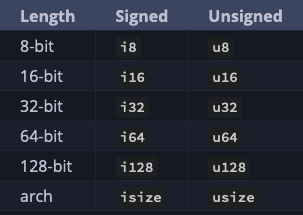
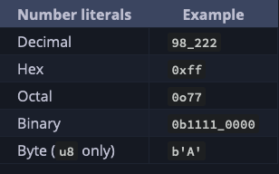

# Rust Programming Language Book Notes

Based on the contents of the **Book**: [The Rust Programming Language](https://doc.rust-lang.org/book/title-page.html)

## Installation

**On Mac**:

```rustup```: a command line tool for managing Rust versions and associated tools.

```bash
curl --proto '=https' --tlsv1.3 https://sh.rustup.rs -sSf | sh
```

To Install linker, which is a program that Rust uses to join its compiled outputs into one file.

```bash
xcode-select --install
```

To check version:

```bash
rustc --version
```

To update Rust:

```bash
rustup update
```

To open the local documentation in your browser:

```bash
rustup doc
```

To run a rust script:

```bash
rustc script.rs
```

## Cargo

Cargo is Rust’s build system and package manager. Cargo handles tasks such as:

- Building the code
- Downloading the libraries the code depends on, and building those libraries

To check Cargo version:

```bash
cargo --version
```

### Project creation with Cargo

```bash
cargo new hello_cargo
```

- creates a new directory and project called *hello_cargo*.
- Under the directory it will create:
  - *Cargo.toml* file  (TOML: Tom's Obvious, Minimal Language is Cargo's configuration format)
    - ```[package]``` heading indicates that the following statements are configuring a package.
    - Next thee lines(name, version, edition) set the config information Cargo needs to compile your program.
    - ```[dependencies]```section to list project's dependencies.
    - *crates*: packages of code are referred to as crates in Rust.
  - *src* directory with a main.rs file inside.
- Also will initialize a new Git repository along with a *.gitignore* file. Git files won’t be generated if run *cargo new* within an existing Git repository.

### Build and Run Cargo project

Build project with following command inside project directory:

```bash
cargo build
```

- If building for first time, creates a file named *Cargo.lock* at the top level to keep track of exact version of dependencies in the project.
- Creates an executable file in *target/debug/project_name* rather than in the current directory.
- Since the default build is a **debug build**, Cargo puts the binary in a directory named *debug*.

To run the executable:

```bash
./target/debug/project_name
```

To do build and run in single command:

```bash
cargo run
```

Command to check the code to make sure it compiles but does not produce an executable,

 ```bash
 cargo check
 ```

- ```cargo check```faster than ```cargo build```
- So, can be used to continually checking the project to make sure that it still compiling. 

### Building for Release

When ready for release, to compile the project with optimizations:

```bash
cargo build --release
```

- create an executable in ```target/release``` instead of ```target/debug```.
- Optimizations makes the Rust code run faster but takes more time to compile.
- Because of this, there are two different profiles:
  1. for development(without ```--release```): when we want to rebuild quickly and often.
  2. for building the final program(with ```--release```) to make the runs as fast as possible.
- For bench marking, run ```cargo build --release```and bench mark with executable in ```target/release```.

## Common programming concepts

### Variables and Mutability

- Variables are immutable by default which make us write code in a way that takes advantage of the safety and easy concurrency the language offers.
- But, have the option to make variable mutable.

Erroneous code example:

```rust
fn main() {
    let x = 5;
    x = 6; // error, reassignment of immutable variable
    println!("The value of x is: {x}")
}
```

Throws error: ```cannot assign twice to immutable variable x```

- Rust compiler guarantees that when we stat that a value won't change, it really won't change. So, we don't need to track of it ourselves.

- To make the variable mutable use `mut` eg:

```rust
fn main() {
    let mut x = 5;
    x = 6;
    println!("The value of x is: {x}") 
}
```

Output will be: ```The value of x is: 6```

#### Constants

- Similar to immutable by defaults but cannot use ```mut``` with them to make it mutable.
- Declare with ```const``` keyword and type of value must be annotated.
- Can be declared in any scope. eg. using global scope make them usable for many parts of the code.
- Constant must set only to a constant expression not the result of a value computed only at runtime.
- Rust’s naming convention for constants is to use all uppercase with underscores between words.

eg:

```rust
const THREE_HOURS_IN_SECONDS: u32 = 60 * 60 * 3;
```

#### Shadowing

We can shadow a variable by using the same variable's name and repeating the use of the ```let``keyword.

eg:

```rust
fn main() {
    let x = 5;

    let x = x + 1;

    {
        let x = x * 2;
        println!("The value of x in the inner scope is: {x}");
    }

    println!("The value of x is: {x}");
}
```

output:

```bash
The value of x in the inner scope is: 12
The value of x is: 6
```

- By using ```let```, we can perform a few transformations on a value but have the variable be immutable after those transformations have been completed.
- With ```let```we are effectively creating a new variable. So, we can change the type of the value but reuse same name.
eg:

```rust
fn main() {
    let spaces = "   ";
    let spaces = spaces.len();
}
```

But, with ```mut``` it's not possible to change variable type.

```rust
fn main() {
    let mut spaces = "   ";
    spaces = spaces.len();
}
```

Will throw compile-time error: ```error[E0308]: mismatched types```

### Data Types

Rust is a statically typed language: means it must know the types of all variables at compile time.

Compiler can usaually infer the datatype based on value. But in case multiple types are possible, we must add a type annotation.

eg:

```rust
let guess: u32 = "42".parse().expect("Nota a number!");
```

There are two kind of data types:

- Scalar
- Compound

#### Scalar

- Represents a single value
- 4 primary scalar types: integers, floating-point numbers, Booleans and Characters

##### Integer

*Integer types in Rust*:
<figure>
  
</figure>

*Integer Literals in Rust*:
<figure>
  
</figure>

- 
#### Compound


### Functions

### Comments

### Control Flow

